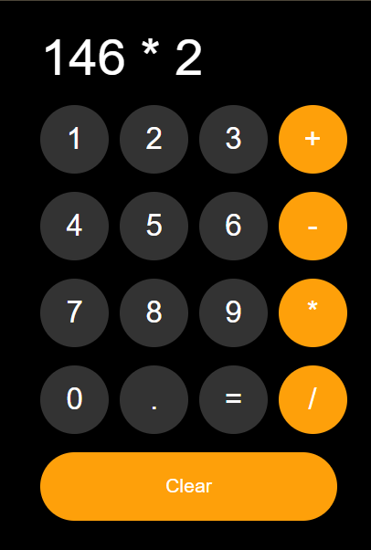

# Calculator

A small web calculator built with HTML, CSS, and JavaScript.

## Live Demo

Open the app in your browser by clicking the link below or navigating to the file directly:

- [Open Calculator](./calculator.html)

## Preview

> If you publish this project to GitHub Pages, replace the above link with your site URL.

## Files

- `calculator.html` - calculator UI markup
- `calculator.css` - styles for the calculator layout
- `calculator.js` - calculator logic and button interactions

## Usage

1. Open `calculator.html` in a web browser.
2. Use the buttons to enter numbers and perform calculations.
3. Click `Clear` to reset the result.
